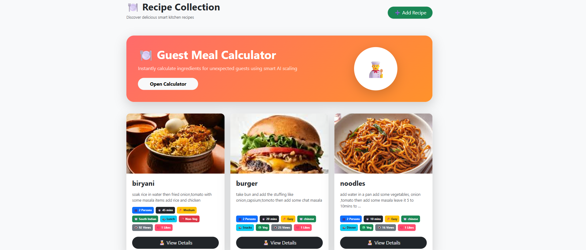
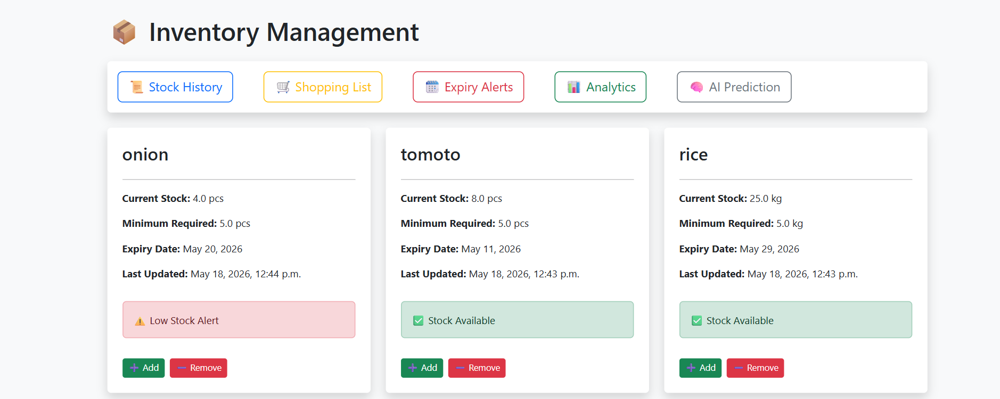
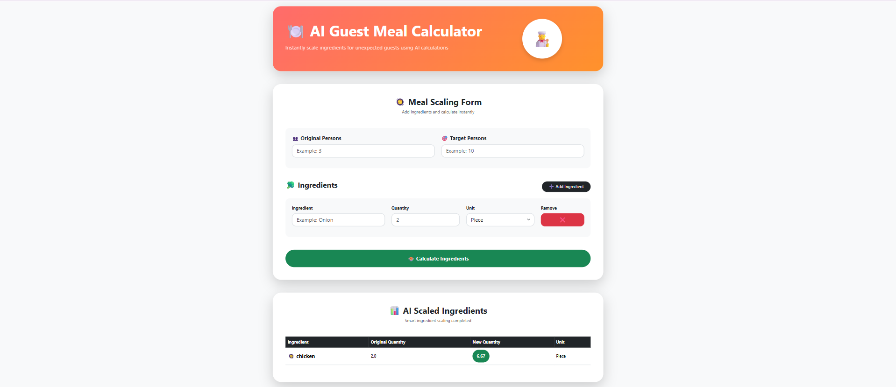
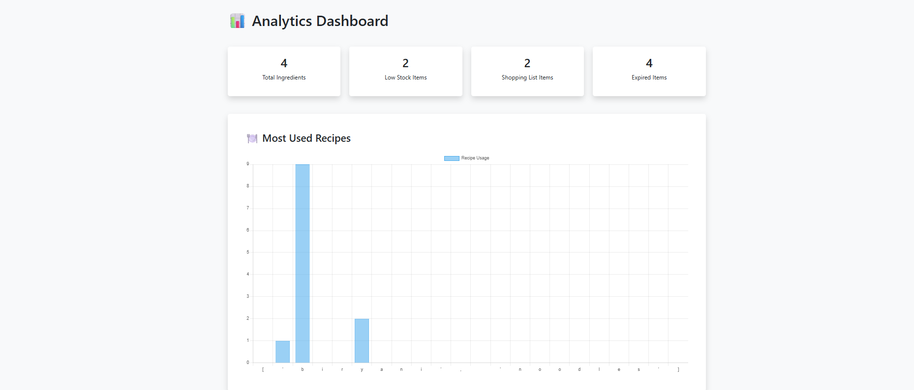

# 🍽️ Smart Kitchen Management System

A web-based Smart Kitchen Management System built using Django that helps users manage recipes, inventory, meal planning, and AI-powered cooking assistance.

## 🚀 Features

- 🍲 Recipe Management
- 📦 Inventory Management
- 👥 Guest Meal Calculator
- 💰 Recipe Cost Calculator
- ❤️ Favorite Recipes
- 📸 Recipe Image Upload
- 🎤 AI Voice Cooking Assistant
- 🥗 Health Recipe Suggestions
- 🍽️ AI Meal Planner
- ♻️ Leftover Food Transformation
- 🌍 Carbon Footprint Calculator
- 🔐 User Authentication
- 📊 Dashboard Analytics

## 🛠️ Technologies Used

### Backend
- Python
- Django
- Django REST Framework (DRF)

### Frontend
- HTML
- CSS
- Bootstrap
- JavaScript

### Database
- SQLite

## 📂 Modules

### Recipe Management
- Create, Update, Delete Recipes
- Recipe Images
- Favorite Recipes
- Cost Calculation

### Inventory Management
- Ingredient Tracking
- Stock Monitoring
- Low Stock Alerts

### Smart Kitchen Features
- Guest Meal Scaling
- Voice Cooking Assistant
- AI Meal Planner
- Health Recipes
- Carbon Footprint Calculator

## ⭐ Future Enhancements

- AI Recipe Recommendation
- Smart Grocery Prediction
- Multilingual Voice Assistant
- Mobile Application

## 📸Screenshoots
 

  
  

  
  

  
  

  
  

